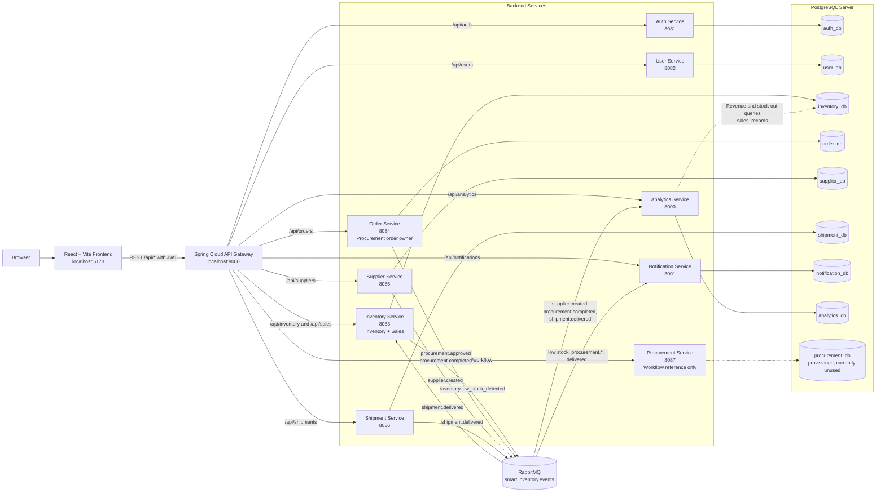
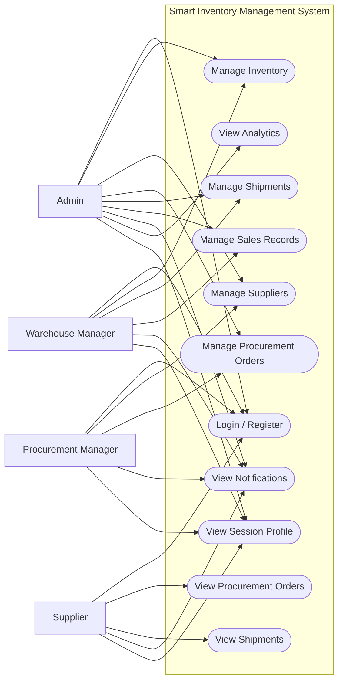
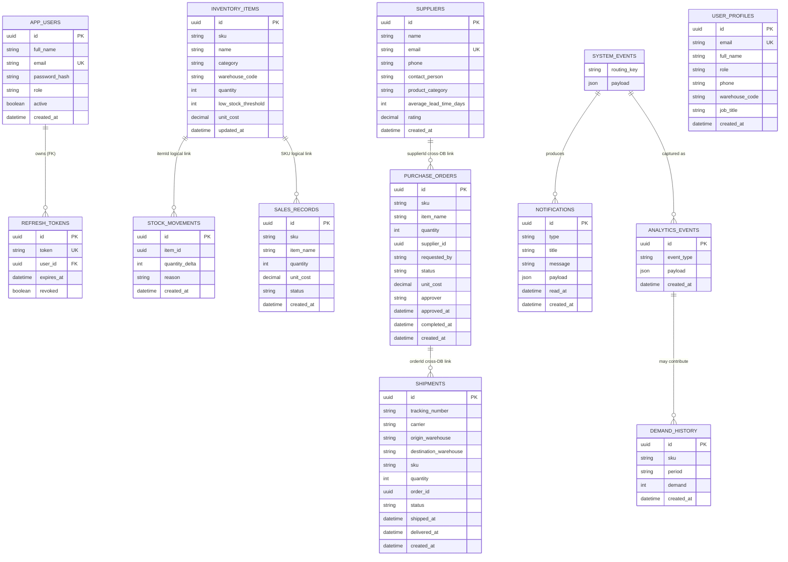
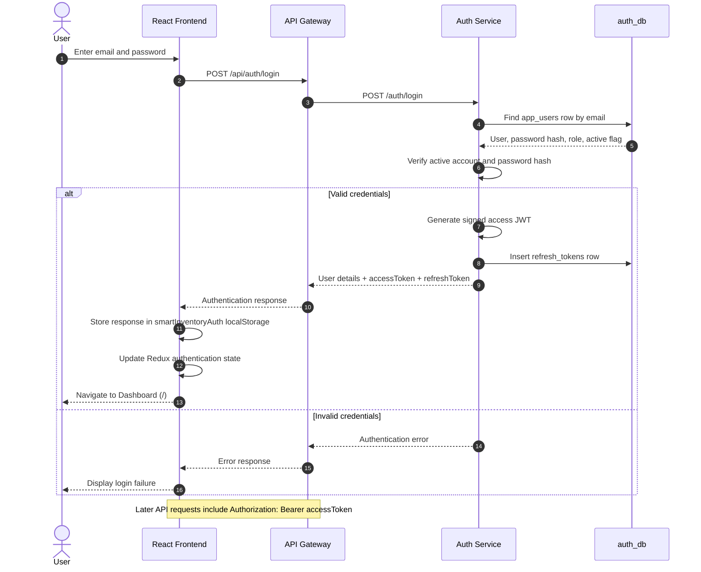
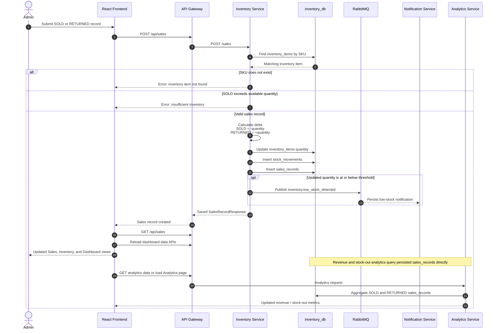
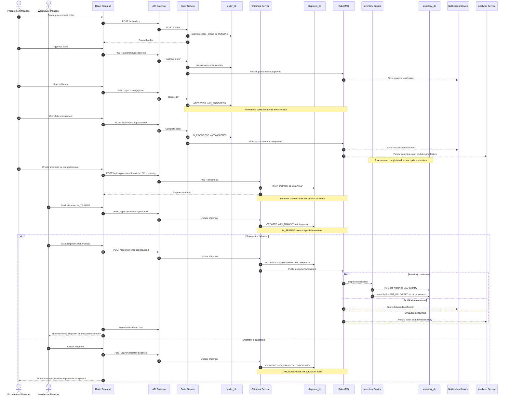
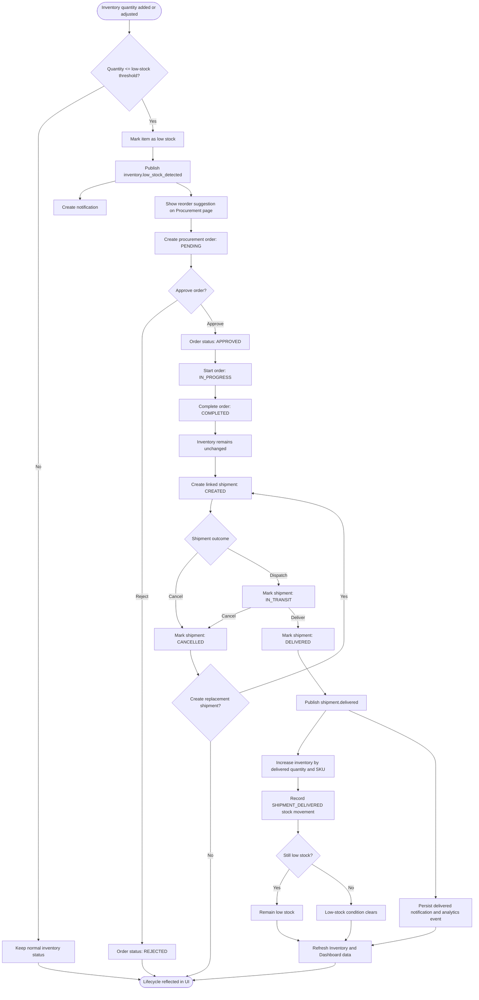
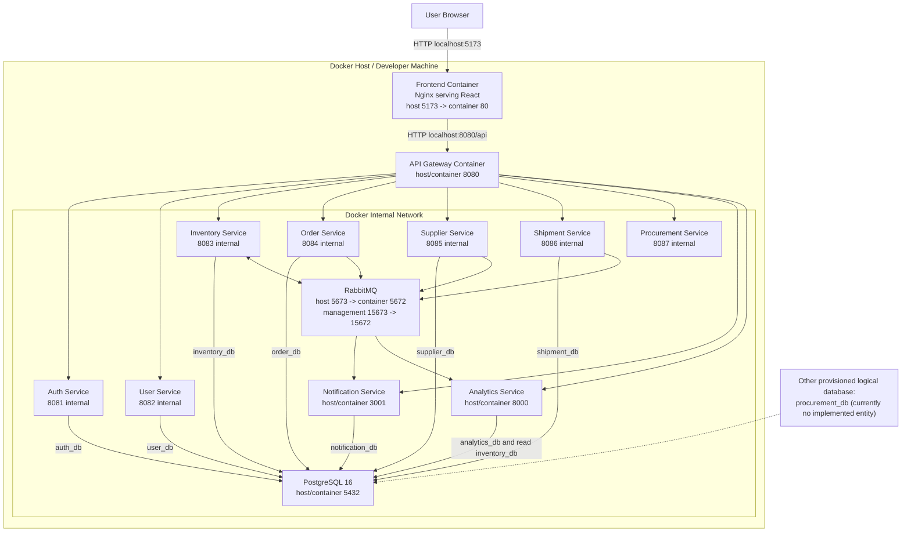

# Smart Inventory Management System Diagrams

These diagrams reflect the current implementation in the repository. Dashed lines represent logical or event-driven relationships rather than database foreign keys.

## 1. System Architecture

## 2. Use Case Diagram

Mermaid does not provide a dedicated UML use-case syntax, so this diagram uses a flowchart with actor-to-use-case associations.

> Current limitation: the Profile page displays account and role information from the authenticated session. Profile editing is not implemented in the frontend.

## 3. Entity-Relationship Diagram

Relationships marked as logical are application-level links across services or scalar identifiers, not enforced cross-database foreign keys.

> `SYSTEM_EVENTS` is a conceptual RabbitMQ event source, not a PostgreSQL table. `user_profiles` is separate from `app_users`; the current frontend Profile page reads the authenticated session rather than this table.

## 4. Sequence Diagram: Login Flow

## 5. Sequence Diagram: Sales Flow

## 6. Sequence Diagram: Procurement to Shipment Flow

## 7. Activity Diagram: Inventory Replenishment Lifecycle

## 8. Deployment Diagram

## Implementation Accuracy Notes

- The frontend Procurement page uses `/api/orders` and the Order Service. The separate Procurement Service currently exposes only `/api/procurements/workflow`.
- Inventory is replenished by the Inventory Service only after consuming `shipment.delivered`; `procurement.completed` does not update inventory.
- Shipment creation, `IN_TRANSIT`, and `CANCELLED` transitions do not currently publish RabbitMQ events.
- Sales records are persisted in `inventory_db.sales_records`. Sales analytics query this table directly; sales creation does not publish a dedicated RabbitMQ event.
- The Analytics Service dashboard still contains some static metrics, while revenue and stock-out calculations use persisted sales records.
- `procurement_db` is created by the database initialization script but has no implemented entity in the current Procurement Service.
